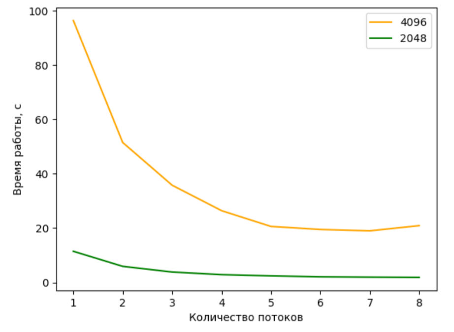
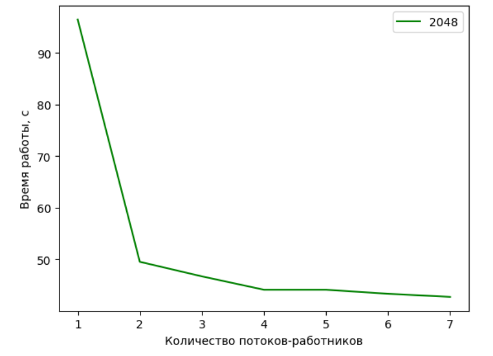

# Параллельное умножение матриц
## Григорий Кострюков, ИВТ-13МО

## Использованные тезнологии
- OpenMP
- MPI

## Эксперимерты и измерения:
Программы выполнялись на матрицах размера 2048x2028 и 4096x4096

## Графики
### OpenMP

### MPI

